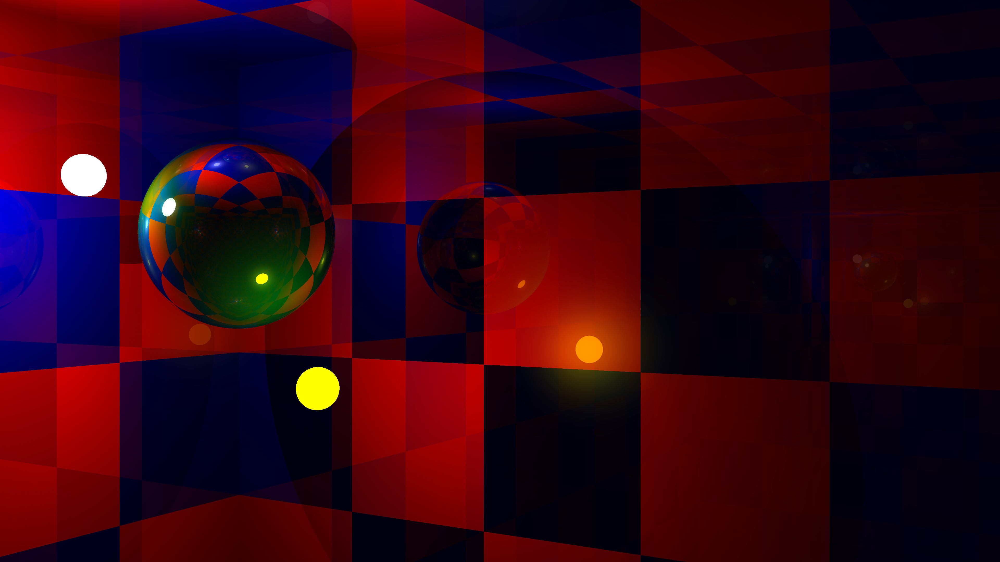
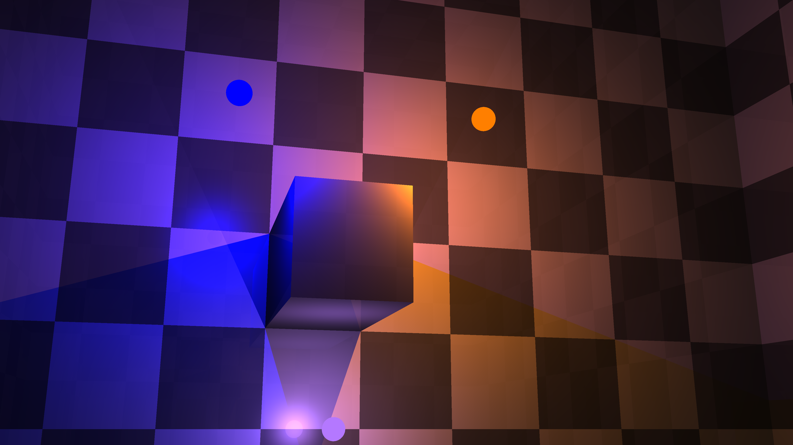

# Slightly artefactual raytracer

Simple raytracer with refractions and reflections, using both [SDF raymarching][srm] and [regular raycasting][rc] using O(1) formulas.

[srm]: http://jamie-wong.com/2016/07/15/ray-marching-signed-distance-functions
[rc]: https://en.wikipedia.org/wiki/Ray_casting

## Some nice rendered images

There will be more in the future.

## Object traits

### `Object`
General trait that all objects must implement regardless of how they will be rendered.

### `MarchingObject`
Trait for objects that will be rendered by raymarching. Requires the declaration of only `sdf` function, which defines the object's Signed distance function.

### `TracingObject`
Trait for objects that will be rendered by normal raycasting using a simple formula. Requires the declaration of only `find_intersection` function, which determines the intersection point of the ray and the object.

### `MetaTracingObject`
Unlike the previous two trait, this one does not require `Object` implementation. The only required method is `build_objects` which returns a list of tracing objects, for example, a list of the object's polygons.

### `ReferenceObject`
Helper trait for meta-objects with some `Object` methods. With the help of it, for example, constructed polygons can conveniently refer to the object that constructed them in color and material getters.

## Input

This is not a completed project, so the test scenes for rendering are still set in main.rs.

## License

[MIT License](LICENSE.txt)